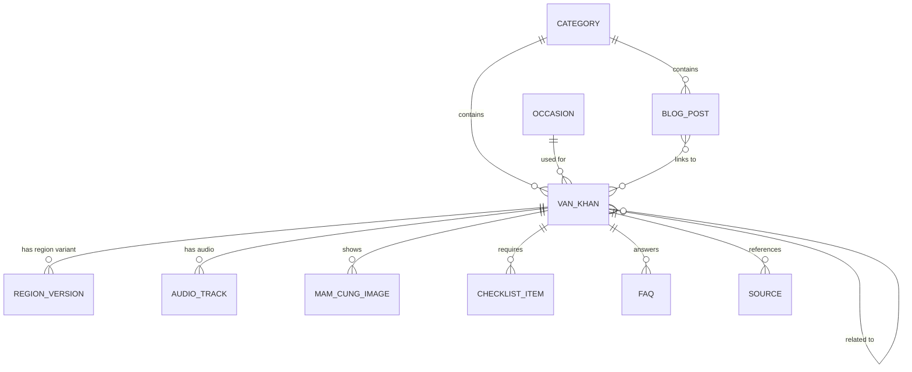
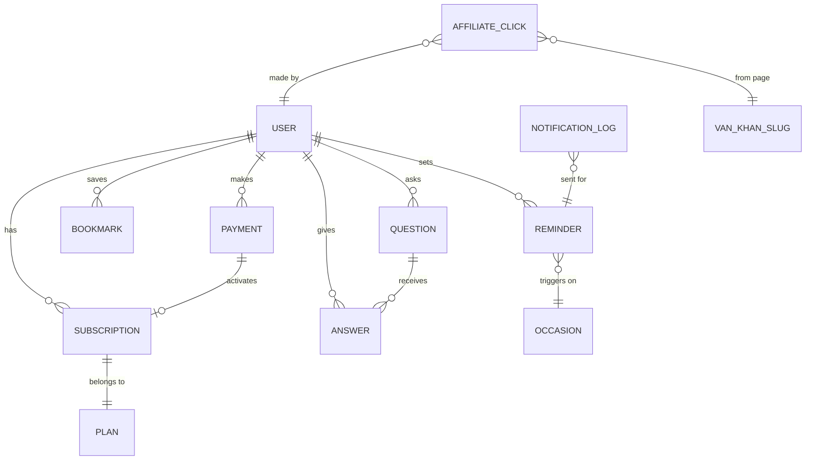

# ERD — Entity Relationship Diagram
## Dự án: Văn Khấn Việt

**Version**: 1.0
**Ngày**: 01/07/2026
**Liên quan**: [BRD.md](./BRD.md), [SRS.md](./SRS.md)

---

## 0. Ghi chú quan trọng

**Phase 1 (MVP)**: **KHÔNG có database**. Toàn bộ nội dung là **static MDX files** trong Git repo, deploy qua Vercel. Không có auth, không có user, không có subscription trong DB.

**Phase 2+**: Cần DB khi mở feature Premium subscription, nhắc lịch, community. Đề xuất **Supabase (Postgres)**.

Tài liệu này mô tả cả 2 model:
- **Content model** (áp dụng ngay Phase 1) — dạng frontmatter MDX
- **Data model** (áp dụng Phase 2+) — dạng bảng SQL

---

## 1. Content model (Phase 1 — MDX-based)

### 1.1 Sơ đồ tổng thể

### 1.2 Entity chi tiết

#### VAN_KHAN (Văn khấn — main entity)

| Field | Type | Required | Note |
|---|---|---|---|
| `slug` | string | ✅ | URL slug, unique, ví dụ: `mung-1-hang-thang` |
| `title` | string | ✅ | Tên hiển thị |
| `category` | enum | ✅ | `hang-thang` / `le-tet` / `gia-dinh` / `kinh-doanh` |
| `occasion_id` | ref | ✅ | Link đến OCCASION |
| `priority` | int | ✅ | 1-5, thứ tự hiển thị trong category |
| `keywords` | string[] | ✅ | SEO keywords |
| `meaning` | markdown | ✅ | Ý nghĩa nghi lễ |
| `preparation` | markdown | ✅ | Cách chuẩn bị tổng quan |
| `taboo` | markdown | ⭕ | Kiêng kỵ, lưu ý |
| `last_reviewed` | date | ✅ | Ngày review cuối, để user biết độ mới |
| `reviewer` | string | ✅ | Ai đã verify |
| `sources` | SOURCE[] | ✅ | Ít nhất 2 nguồn |
| `region_versions` | REGION_VERSION[] | ✅ | Ít nhất 1 phiên bản vùng |
| `audio_tracks` | AUDIO_TRACK[] | ⭕ | Phase 2 |
| `checklist` | CHECKLIST_ITEM[] | ✅ | Mâm cúng chi tiết |
| `faqs` | FAQ[] | ⭕ | Câu hỏi thường gặp |
| `related_slugs` | string[] | ⭕ | Slug các văn khấn liên quan |
| `image_main` | string | ✅ | Path ảnh mâm cúng chính |

**MDX form**: Toàn bộ được viết trong file `content/van-khan/{slug}.mdx` với frontmatter + body Markdown/MDX.

#### REGION_VERSION (Phiên bản theo vùng)

| Field | Type | Required | Note |
|---|---|---|---|
| `region` | enum | ✅ | `bac` / `trung` / `nam` |
| `text` | markdown | ✅ | Toàn bộ văn khấn cho vùng đó |
| `notes` | markdown | ⭕ | Ghi chú riêng của vùng |

#### AUDIO_TRACK (Phase 2)

| Field | Type | Required | Note |
|---|---|---|---|
| `region` | enum | ✅ | `bac` / `trung` / `nam` |
| `voice` | enum | ✅ | `thay` (thầy) / `nam` / `nu` |
| `url` | string | ✅ | CDN URL |
| `duration_seconds` | int | ✅ |  |
| `is_premium` | bool | ✅ | Free có 15s preview, premium full |
| `file_size_kb` | int | ✅ |  |

#### MAM_CUNG_IMAGE

| Field | Type | Required |
|---|---|---|
| `url` | string | ✅ |
| `caption` | string | ⭕ |
| `angle` | enum | ⭕ | `main` / `top-down` / `side` |
| `region` | enum | ⭕ | Có thể khác nhau theo vùng |

#### CHECKLIST_ITEM

| Field | Type | Required |
|---|---|---|
| `item` | string | ✅ | Ví dụ: "5 loại hoa quả tươi" |
| `quantity` | string | ⭕ | Ví dụ: "1 đĩa" |
| `note` | string | ⭕ | Ví dụ: "Không dùng chuối vào cúng thần tài" |
| `is_required` | bool | ✅ |  |

#### FAQ

| Field | Type | Required |
|---|---|---|
| `question` | string | ✅ |
| `answer` | markdown | ✅ |

#### SOURCE

| Field | Type | Required |
|---|---|---|
| `title` | string | ✅ | Tên sách/tài liệu |
| `publisher` | string | ⭕ |
| `year` | int | ⭕ |
| `author` | string | ⭕ |
| `url` | string | ⭕ | Nếu là online source |

#### OCCASION (Dịp cúng)

| Field | Type | Required | Note |
|---|---|---|---|
| `id` | string | ✅ | ví dụ: `mung-1-monthly`, `vu-lan`, `tet-nguyen-dan` |
| `name` | string | ✅ | Tên dịp |
| `type` | enum | ✅ | `monthly` / `yearly` / `one-time` / `family` |
| `lunar_date` | object | ⭕ | `{month: 7, day: 15}` cho lễ cố định âm lịch |
| `solar_date` | object | ⭕ | Cho lễ dương lịch |
| `description` | markdown | ⭕ |  |

#### CATEGORY

| Field | Type | Required |
|---|---|---|
| `slug` | string | ✅ |
| `name` | string | ✅ |
| `description` | string | ⭕ |
| `order` | int | ✅ |
| `icon` | string | ⭕ |

Categories (fixed enum):
- `hang-thang` — Hàng tháng (mùng 1, rằm, thần tài mùng 10...)
- `le-tet` — Lễ Tết (giao thừa, ông Táo, khai xuân, Vu Lan, cô hồn...)
- `gia-dinh` — Gia đình (đầy tháng, thôi nôi, giỗ, cưới hỏi...)
- `kinh-doanh` — Kinh doanh (khai trương, nhập trạch, cúng đất, cúng xe...)

#### BLOG_POST

| Field | Type | Required |
|---|---|---|
| `slug` | string | ✅ |
| `title` | string | ✅ |
| `category` | enum | ✅ | `y-nghia` / `chuan-bi` / `hoi-dap` / `cau-chuyen` |
| `excerpt` | string | ✅ |
| `body` | markdown | ✅ |
| `related_van_khan` | string[] | ⭕ | Slug văn khấn liên quan |
| `published_at` | date | ✅ |
| `image_cover` | string | ✅ |
| `word_count` | int | ✅ | Auto-calculated, min 800 |

---

## 2. Data model (Phase 2+ — Database)

### 2.1 Sơ đồ

### 2.2 Bảng chi tiết

#### `users`

| Column | Type | Constraint |
|---|---|---|
| `id` | uuid | PK |
| `email` | varchar(255) | UNIQUE, INDEX |
| `phone` | varchar(20) | UNIQUE, INDEX, NULL |
| `display_name` | varchar(100) | NULL |
| `region_preference` | varchar(10) | DEFAULT 'bac' |
| `is_premium` | boolean | DEFAULT false |
| `premium_expires_at` | timestamp | NULL |
| `created_at` | timestamp | DEFAULT now() |
| `last_login_at` | timestamp | NULL |
| `notification_channel` | varchar(20) | 'email' / 'zalo' / 'both' |
| `phone_verified` | boolean | DEFAULT false |

**Note**: Không dùng password. Auth qua magic link email hoặc OTP Zalo.

#### `plans`

| Column | Type | Constraint |
|---|---|---|
| `id` | serial | PK |
| `slug` | varchar(50) | UNIQUE |
| `name` | varchar(100) |  |
| `price_vnd` | int |  |
| `duration_days` | int |  |
| `features` | jsonb |  |
| `is_active` | boolean | DEFAULT true |

**Seed data**:
- `premium-monthly`: 39.000 VNĐ / 30 ngày
- `premium-yearly`: 299.000 VNĐ / 365 ngày (giảm 36%)

#### `subscriptions`

| Column | Type | Constraint |
|---|---|---|
| `id` | uuid | PK |
| `user_id` | uuid | FK → users.id |
| `plan_id` | int | FK → plans.id |
| `started_at` | timestamp |  |
| `expires_at` | timestamp |  |
| `status` | varchar(20) | 'active' / 'expired' / 'cancelled' |
| `payment_id` | uuid | FK → payments.id |
| `auto_renew` | boolean | DEFAULT false (Phase 2: manual renew) |

#### `payments`

| Column | Type | Constraint |
|---|---|---|
| `id` | uuid | PK |
| `user_id` | uuid | FK → users.id, NULL (guest checkout) |
| `email` | varchar(255) | Backup nếu không có user |
| `amount_vnd` | int |  |
| `method` | varchar(20) | 'vnpay' / 'momo' / 'bank_transfer' |
| `status` | varchar(20) | 'pending' / 'success' / 'failed' / 'refunded' |
| `transaction_ref` | varchar(100) | Ref từ payment gateway |
| `plan_id` | int | FK → plans.id |
| `created_at` | timestamp |  |
| `paid_at` | timestamp | NULL |

#### `reminders`

| Column | Type | Constraint |
|---|---|---|
| `id` | uuid | PK |
| `user_id` | uuid | FK → users.id, NULL (anonymous) |
| `email` | varchar(255) | Backup nếu không có user |
| `phone` | varchar(20) | NULL |
| `occasion_id` | varchar(100) | Ref content OCCASION |
| `van_khan_slug` | varchar(100) | Content ref |
| `notify_channel` | varchar(20) | 'email' / 'zalo' |
| `advance_hours` | int | Nhắc trước bao nhiêu giờ, mặc định 24 |
| `is_active` | boolean | DEFAULT true |
| `next_fire_at` | timestamp | Tính từ lunar calendar |
| `created_at` | timestamp |  |
| `unsubscribe_token` | varchar(50) | UNIQUE, để user tự huỷ qua link |

**Index**: `next_fire_at` (cho cron scan hourly), `unsubscribe_token`

#### `notification_logs`

| Column | Type | Constraint |
|---|---|---|
| `id` | uuid | PK |
| `reminder_id` | uuid | FK → reminders.id |
| `sent_at` | timestamp |  |
| `channel` | varchar(20) |  |
| `status` | varchar(20) | 'sent' / 'failed' / 'bounced' |
| `error` | text | NULL |

#### `bookmarks`

| Column | Type | Constraint |
|---|---|---|
| `id` | uuid | PK |
| `user_id` | uuid | FK → users.id |
| `van_khan_slug` | varchar(100) |  |
| `created_at` | timestamp |  |

**Unique constraint**: `(user_id, van_khan_slug)`

#### `questions` (Phase 3)

| Column | Type | Constraint |
|---|---|---|
| `id` | uuid | PK |
| `user_id` | uuid | FK → users.id |
| `title` | varchar(200) |  |
| `body` | text |  |
| `van_khan_slug` | varchar(100) | Related content, NULL |
| `status` | varchar(20) | 'pending' / 'approved' / 'rejected' |
| `moderator_note` | text | NULL |
| `image_url` | varchar(500) | NULL |
| `upvote_count` | int | DEFAULT 0 |
| `created_at` | timestamp |  |

#### `answers` (Phase 3)

| Column | Type | Constraint |
|---|---|---|
| `id` | uuid | PK |
| `question_id` | uuid | FK → questions.id |
| `user_id` | uuid | FK → users.id |
| `body` | text |  |
| `is_official` | boolean | DEFAULT false (admin/thầy trả lời) |
| `upvote_count` | int | DEFAULT 0 |
| `is_accepted` | boolean | DEFAULT false |
| `created_at` | timestamp |  |

#### `affiliate_clicks` (Phase 2)

| Column | Type | Constraint |
|---|---|---|
| `id` | uuid | PK |
| `user_id` | uuid | NULL (anonymous) |
| `session_id` | varchar(100) | Cookie-based session |
| `van_khan_slug` | varchar(100) | Trang phát sinh click |
| `partner` | varchar(50) | 'shopee' / 'lazada' / 'local-vendor-x' |
| `product_id` | varchar(100) |  |
| `clicked_at` | timestamp |  |
| `converted` | boolean | DEFAULT false (nếu partner báo có mua) |
| `revenue_vnd` | int | NULL |

---

## 3. Content ID conventions

### 3.1 Slug rules

- Chỉ ký tự `a-z`, `0-9`, `-`
- Bỏ dấu tiếng Việt (`á` → `a`)
- Ngắn nhưng đủ nghĩa
- Bao gồm keyword SEO chính

**Examples**:
- ✅ `mung-1-hang-thang`
- ✅ `van-khan-nhap-trach-nha-moi` (nếu cần SEO mạnh)
- ✅ `vu-lan-ram-thang-7`
- ❌ `mung1` (không SEO)
- ❌ `mùng-1-hàng-tháng` (có dấu)

### 3.2 Occasion ID

Format: `{event}-{recurrence}`
- `mung-1-monthly`
- `ram-monthly`
- `vu-lan-yearly`
- `giao-thua-yearly`
- `dam-thang-family` (dịp gia đình, không cố định ngày)

---

## 4. Lunar calendar handling

**Vấn đề**: Nhiều dịp cúng dựa vào âm lịch (mùng 1, rằm, Vu Lan 15/7 âm...), không phải dương lịch.

**Giải pháp phase 1**:
- Dùng library `lunar-typescript` hoặc `chinese-lunar-calendar`
- Compute at runtime, cache 30 ngày tới trong localStorage/JSON tĩnh
- Tất cả OCCASION có `lunar_date` sẽ được tính ngày dương tương ứng cho năm hiện tại

**Giải pháp phase 2** (cần nhắc lịch chính xác):
- Tại thời điểm user set reminder → compute lịch âm tất cả occurrence trong 12 tháng tới
- Lưu vào `reminders.next_fire_at` (dương lịch)
- Cron job scan `next_fire_at <= NOW() + interval '25 hours'` để gửi mail

---

## 5. Sample data cho MVP

**15 văn khấn priorities** (từ SRS Section 3.1):

| Slug | Category | Occasion | Region priority |
|---|---|---|---|
| `mung-1-than-linh-gia-tien` | hang-thang | mung-1-monthly | Bắc, Trung, Nam |
| `ram-than-linh-gia-tien` | hang-thang | ram-monthly | Bắc, Trung, Nam |
| `tho-cong-tho-dia` | hang-thang | mung-1-monthly | Bắc |
| `nhap-trach-nha-moi` | kinh-doanh | one-time | Bắc, Trung, Nam |
| `day-thang-be-gai` | gia-dinh | family | Bắc, Trung, Nam |
| `day-thang-be-trai` | gia-dinh | family | Bắc, Trung, Nam |
| `vu-lan-ram-thang-7` | le-tet | vu-lan-yearly | Bắc, Trung, Nam |
| `cung-co-hon-mung-2-16` | hang-thang | co-hon-bimonthly | Bắc, Trung, Nam |
| `gio-dau-cha-me` | gia-dinh | family | Bắc, Trung, Nam |
| `ong-cong-ong-tao` | le-tet | ong-tao-yearly | Bắc, Trung, Nam |
| `tat-nien` | le-tet | tat-nien-yearly | Bắc, Trung, Nam |
| `giao-thua-ngoai-troi` | le-tet | giao-thua-yearly | Bắc, Trung, Nam |
| `giao-thua-trong-nha` | le-tet | giao-thua-yearly | Bắc, Trung, Nam |
| `khai-xuan-mung-1-tet` | le-tet | khai-xuan-yearly | Bắc, Trung, Nam |
| `khai-truong` | kinh-doanh | one-time | Bắc, Trung, Nam |

---

## 6. Migration path

### Phase 1 → Phase 2

Khi thêm DB:
1. Content vẫn ở MDX files (nguồn chính)
2. DB chỉ chứa **user-generated data** (subscription, reminder, bookmark, payment)
3. Không migrate content vào DB — MDX vẫn là source of truth

### Phase 2 → Phase 3

Khi thêm community:
1. Bảng `questions`, `answers`
2. Không migrate MDX vào DB
3. Xem xét thêm cache layer (Redis) nếu traffic tăng

---

## 7. Data privacy

Theo Luật An ninh mạng VN + Nghị định 13/2023:

- **Email/Phone**: PII, cần **encryption at rest** (Postgres pgcrypto hoặc app-level AES)
- **Payment**: KHÔNG lưu card number, CVV, PIN. Chỉ lưu `transaction_ref` từ gateway.
- **Retention**: xoá `notification_logs` cũ hơn 90 ngày. Xoá `payments failed` sau 12 tháng.
- **User right**: có endpoint `/api/user/delete` để user tự xoá toàn bộ data về mình.

---

## 8. Backup & DR

**Phase 1**: Git = backup (nếu Vercel mất, redeploy từ Github).

**Phase 2**:
- Supabase auto backup hàng ngày (free tier có 7 ngày retention)
- Weekly full dump ra R2/S3 (script)
- Test restore quy trình mỗi 3 tháng

---

## 9. Câu hỏi mở (chưa quyết)

- [ ] Cần chọn `lunar-typescript` hay `lunar-javascript` hay tự viết? → Test tuần 1
- [ ] Auth phase 2: magic link email hay OTP Zalo? → Depends on Zalo API access
- [ ] Có cần bảng `feedbacks` cho user report content sai? → Có, nên có từ phase 1 (Google Form đơn giản trước)
- [ ] Có Contentlayer v2 hay Fumadocs cho MDX processing? → Đánh giá tuần 2

---

**Next step**: Tôi có thể tạo starter code Next.js + template `mung-1-hang-thang.mdx` mẫu để bạn bắt đầu Ngày 2 không phải nghĩ. Gọi tôi khi ready.

